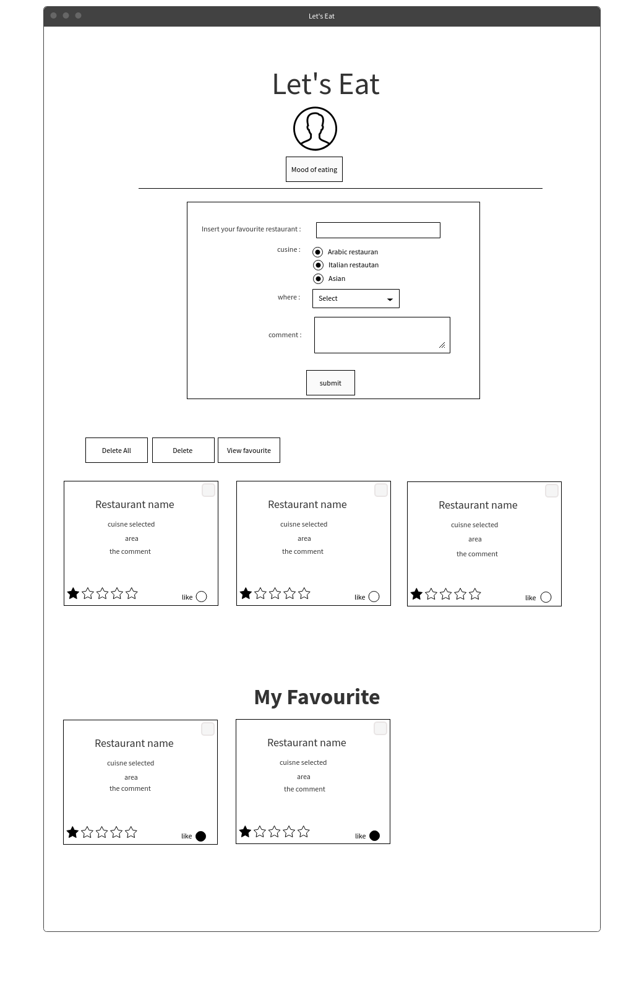

## Restaurant Favorite Application

------

### Overview

* since Riyadh has so much restaurants that some times you can not remember what/where your favourite resturant.
* So this app provid you  with a fourm page that you can fill it and submit it. 
* Then, user can view his/her favorite resturant, rate it, make favorite list and delete it .

#### Table of Countenet

1. Tist of technologies used
2. User story
3. Wireframe
4. Development process
5. The winner conditions
6. Future development plan

------

#### List of technologies used

* JavaScript, CSS, HTML
* Bootstrab
* React
* Axios, Jason, Ajax
* API

##### Wireframe

##### User Story : 

### User Stories

* As a user, I should be able to add a new resturant
* As a user, I should be able to click on an resturan and do : 

  * rate it
  * favourite
  * delete it 

* As a user, I should be select added resturant abd delete them
* As a user, I should disply favourite list and hid it
* As a user, I can generate a random giphy each time 

##### Development Process

First start the propject with wairefram to make a clear picture in the mind how many component the app needs. 
The start with coding in React to make a list and do some of the functionality the list has like :

* add
* delete 
* Rateing 
* add to favorite
* view favorite list

after that, add the Ghiy gits to the page. it generate a random pic related to the food by every click.
